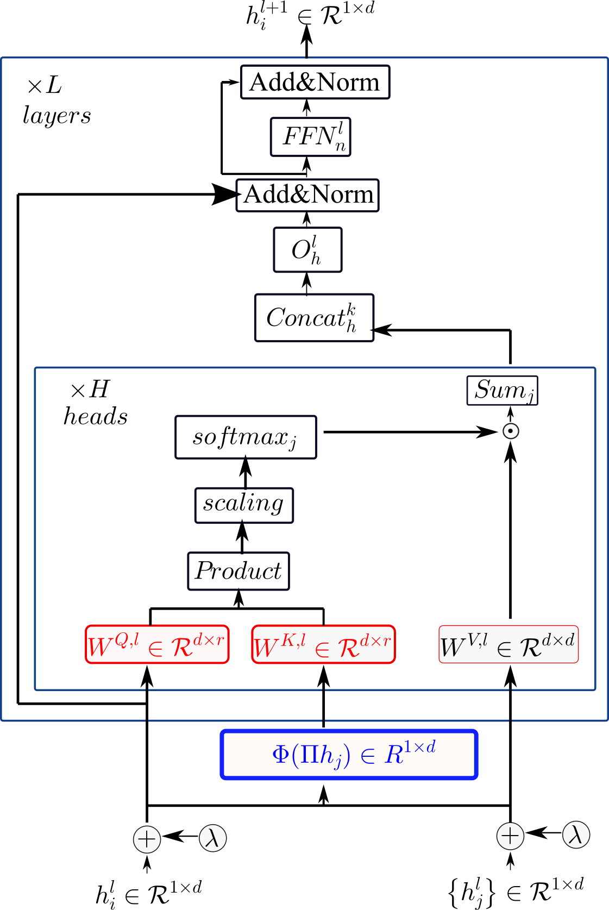
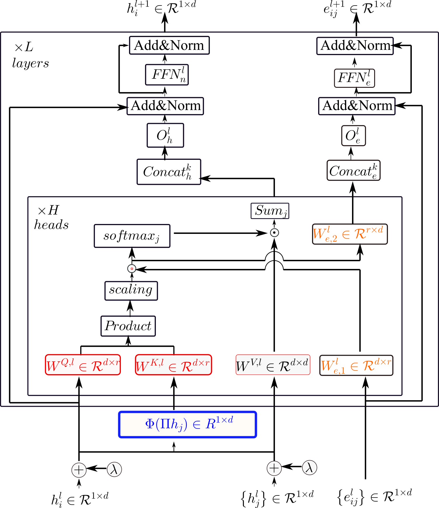

ERROR:
    self._handle = _dlopen(self._name, mode)
OSError: [WinError 127] The specified procedure could not be found  --- VERSION IS WRONG, REINSTALL WITH CORRECT VERSION.

# GR-representation Transformer Architecture

Source code for the paper "**[Low-Rank and Global-Representation-Key-based Attention for Graph Transformer](link to paper)**".

Low-Rank and Global-Representation-Key-based Attention : 
- We proposed a low-rank GR-Key-based attention mechanism, where the global representation(s) forms the \textit{Key} providing the structural importance of neighbor nodes. This proposed attention method decreases the training parameter number and is adjustable to the latent feature rank. 
- We propose investigating various compositions of virtual representation(s) that explore the isomorphic and heterogeneous properties in graph data, which alleviates the over-smoothing and heterophily issues.
- We incorporate the proposed attention mechanism into a simple GNN model, accomplish regression/classification tasks on eight widely used benchmark datasets, and justify the proposed method's effectiveness and superiority. 
<br>

<p align="center">
  
  <br>
  <b>Figure</b>: Block Diagram of GR-based Transformer Architecture
</p>

<p align="center">
  
  <br>
  <b>Figure</b>: Block Diagram of GR-based Transformer Architecture
</p>

## https://chrsmrrs.github.io/datasets/docs/datasets/
## 1. Repo installation

This project is based on the [benchmarking-gnns](https://github.com/graphdeeplearning/benchmarking-gnns) repository.
and [Vijay Prakash Dwivedi](https://github.com/vijaydwivedi75) and [Xavier Bresson](https://github.com/xbresson)_
[Follow these instructions](./docs/01_benchmark_installation.md) to install the benchmark and setup the environment.


<br>

## 2. Download datasets and 3. Reproducibility 

please read the docs

<br>

## 4. Reference 
 
```

```


<br><br><br>

